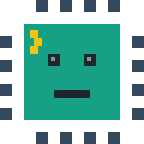

 

Passionate about computer science and electronics, I enjoy understanding how
systems work from the hardware up to the software.

 

## Tech Stack

**Languages**

**Embedded & Electronics**

**Tools & Platforms**

 

## Connect with me

